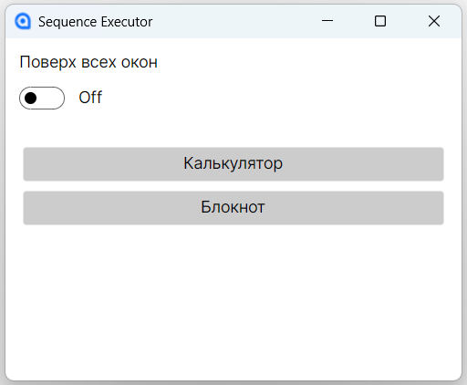

## 🚀 Как использовать

1️⃣ Положить файл `sequences.json` с нужным содержимым в папку `SequenceExecutor/`

В проекте уже есть **тестовый json**, так что можно запустить сразу

2️⃣ Запустить приложение

3️⃣ Что получится в результате:

- На экране отобразятся все активные цепочки в виде кнопок
- Можно запускать цепочки, состоящие из 1 инструмента типа 'exe'. При попытке запустить другие цепочки, появится окно с предупреждением
- Можно зафиксировать приложение поверх остальных приложений с помощью переключателя

## 🚀 Скрины UI

**Приложение, запущенное с тестовым json-файлом:**

**Ошибка при попытке запустить цепочку из 2 инструментов:**

**Ошибка при попытке запустить цепочку с инструментом другого типа:**

